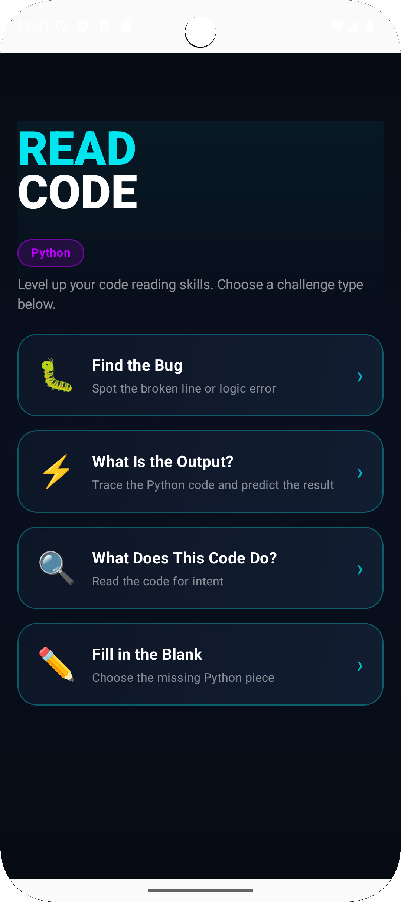
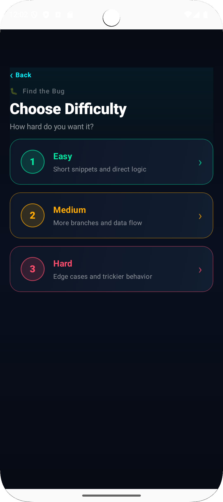
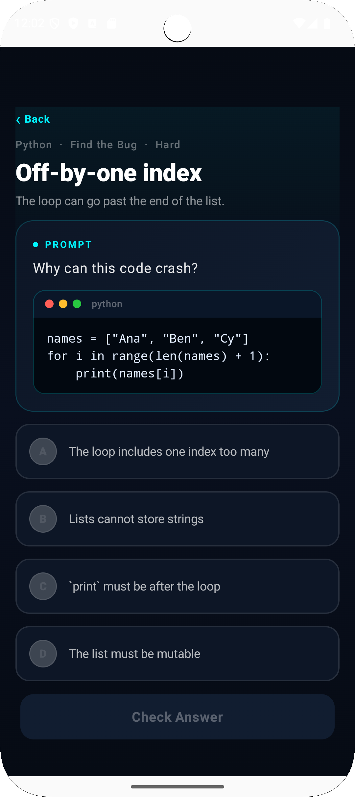

# ReadCode

> **Train your brain to read code — not just write it.**

ReadCode is a focused Android app for sharpening code-reading skills through fast, tap-based multiple-choice challenges. No keyboard. No setup. Just you and the code.

  
  &nbsp;&nbsp;&nbsp;
  
  &nbsp;&nbsp;&nbsp;
  

---

## What It Does

Most coding practice focuses on *writing* code. ReadCode flips that — it trains the skill that senior engineers use constantly: quickly reading unfamiliar code and understanding what it does, why it might fail, and what it produces.

## Challenge Types

| Challenge | What You Do |
|---|---|
| **Find the Bug** | Spot the broken line or logic error |
| **What Is the Output?** | Trace the code and predict the result |
| **What Does This Code Do?** | Read the code for intent |
| **Fill in the Blank** | Choose the missing Python piece |

## Difficulty Levels

- **Easy** — Short snippets and direct logic
- **Medium** — More branches and data flow
- **Hard** — Edge cases and trickier behavior

## Features

- Dark, code-editor aesthetic — easy on the eyes during long sessions
- Zero typing required — all answers are tap-based multiple choice
- Progress tracking — completed problems are marked in the list
- Jump to a random problem from any filtered list
- Breadcrumb navigation — always know where you are

## Tech Stack

- **Language:** Kotlin
- **UI:** Jetpack Compose
- **Architecture:** Single-activity, in-memory state with Compose `remember`
- **Build:** Gradle with version catalog

## Getting Started

1. Clone the repo
2. Open in Android Studio
3. Run on a device or emulator (API 21+)

No API keys. No backend. Just build and go.

---

*Currently Python-only. The data model is built to support additional languages when the time comes.*
